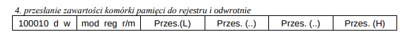
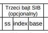
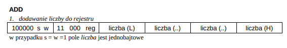
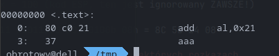

## mod=00 i r/m=101 -> adres efektywny to adres znajdujący się na **4-bajtowym** polu offset
### Przykład
```
.data           ; załóżmy że segment .data zaczyna sie od adresu 0300h
db kielnia 0
dd globus ?

.code
mov ebx, dword PTR globus
```


- d=1 -> reg odbiera wiadomość
- w=1 -> 4 bajtowe dane
- reg=011 (kod EBXa)
- **mod=00 i r/m=101** -> podajemy bezpośrednio adres fizyczny w **4-bajtowym** polu offset
- adres = 0300h + 1h (musimy pominąć zmienną **kielnia**) = 0301h

10001011 00011101b = 8B 1D 01 03 00 00 (pamiętamy o tym, że x86 jest little endian a także uzupełniamy 0 żeby dobić do 4 bajtów, w przeciwnym wypadku procesor wezmie adres zlozony z naszych bajtow + jakis losowych bajtow ktore byly w pamieci)

## mod=00 i base=101 -> pole base w bajcie SIB ignoruje się
### Przykład
```
mov [ebx*4+12], ecx
```



- d=0 -> zapisujemy zawartosc rejestru do pamięci
- w=1 -> operujemy na 4-bajtowych danych
- zauważmy, że w **[ebx*4+12]** nie mamy base, mamy jedynie indeks, jako że nie ma możliwości zakodowania **base=nieistnieje** musimy skorzystać z wyżej podanej własności **mod=00 i base=101 -> base sie ignoruje**
- reg = 001 (kod ECXa)
- r/m = 100 (adres wskazany jest przez bajt SIB)
- ss = 10 (indeks mnożymy przez 4)
- index = 011 (kod EBXa)
- base = 101 (kod EBP, lecz mod=00 wymusza ignorowanie go)
- offset = 12 **(zapisane na 4 bajtach, analogicznie do poprzedniego przykładu)**

10001001 00001100 10011101b = 89 0C 9D 0C 00 00 00

#### Czemu ten offset zawsze zajmuje 4 bajty w tym wypadku?
Bo adres zajmuje 4 bajty, więc fajnie byłoby, żeby można było używać 4-bajtowego offsetu, a nie mamy jak wskazać rozmiaru offsetu, więc lepiej potencjalnie marnować 3 bajty w pamięci niż ucinać funkcjonalność (w postaci offsetów nie większych niż 127 tak jak to ma miejsce w rozkazie loop)

## ESP jako index w bajcie SIB jest ignorowane
### Przykład
```
mov ebx, [esp+8]
```


- d = 1 -> odbiorcą jest rejestr
- w = 1 -> 4 bajtowe dane
- mod = 01 (można też użyć 10, ale nam 1 bajt w zupełności wystarczy do zakodowania 8ki jako offset)
- reg = 011 (kod EBXa)
- r/m = 100 (adres pamięci wyliczany jest za pomocą bajtu SIB)
- ss=00 = indeks mnozymy razy 1 (mozna sprawdzic, co sie stanie dla innych, jako ze index i tak jest ignorowany to nie powinno sie nic dziac)
- base=100 (kod ESP)
- index = 100 (kod ESP, ten jest ignorowany ZAWSZE!)

10001011 01011100 00100100b 08h = 8C 5B 24 08

# Zamieszanie wokół bitu s w niektórych rozkazach


## Gdy w = 1 -> rejestr 32 lub 16 bitowy
- s = 1 -> liczba 1 bajtowa
- s = 0 -> liczba 4/2 bajtowa

## Gdy w = 0 -> rejestr 8-bitowy
wtedy bezsensem byloby dodawanie/odejmowanie liczby 4 lub 2 bajtowej, wiec bit s nie ma znaczenia (nawet jeśli jest równy 0, to liczba jest 1 bajtowa)

