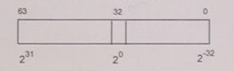

# Zadania
## Zadanie 1
Studenciak miał za zadanie napisać podprogram w 32-bitowym assemblerze który dokonuje konwersji z 64-bitowego formatu śródprzecinkowego **MIESZ** na **float**.\
\
Jednak coś spierdolił, znajdź błąd.
```
_miesz2float PROC
    ; Wejście: q na stosie (64-bit MIESZ)
    ; Zwraca: wynik w rejestrze ST(0) (float)

    ; Załaduj argumenty (64-bit MIESZ: część całkowita i ułamkowa)
    mov eax, [esp + 8]  ; Niższe 32 bity (część ułamkowa)
    mov edx, [esp + 12] ; Wyższe 32 bity (część całkowita)

    ; Konwersja części całkowitej (EDX) na float
    push edx           ; Umieść część całkowitą na stos
    fild dword ptr [esp]   ; Załaduj jako float do ST(0)
    add esp, 4         ; Usuń z stosu

    ; Konwersja części ułamkowej (EAX) na float
    push eax           ; Umieść część ułamkową na stos
    fild dword ptr [esp]   ; Załaduj jako float do ST(0)
    add esp, 4         ; Usuń z stosu

    ; Podziel część ułamkową przez 2^32 (0x4F000000 w IEEE 754)
    mov eax, 4F000000h ; 2^32 w formacie float
    push eax           ; Umieść na stos
    fild dword ptr [esp]   ; Załaduj 2^32 do ST(0)
    add esp, 4         ; Usuń z stosu
    fdiv st(0), st(1)  ; Podziel ST(0) przez ST(1)

    ; Dodaj część całkowitą i ułamkową
    fadd st(0), st(1)  ; Dodaj ST(0) + ST(1)

    ; Zwróć wynik (ST(0) zawiera wartość float)
    ret
_miesz2float ENDP
```

## Zadanie 2
Dla takich samych typów danych, inny studenciak miał napisać podprogram dokonujący konwersję w drugą stroną tj. z **float** na **MIESZ**, jednak też coś mu nie poszło.
```
_float2miesz PROC
    ; Wczytaj wartość float spod wskaźnika q
    fld dword ptr [esp+4]        ; Załaduj wartość zmiennoprzecinkową do rejestru FPU (ST(0))
    
    ; Pomnóż przez 2^32, aby przesunąć część ułamkową do pełnej liczby całkowitej
    mov eax, 4f800000h    ; 2^32 w postaci float (2^(31+1) = 4f800000h)
    push eax
    fld dword ptr [esp]        ; Załaduj 2^32 do FPU (ST(0) = 2^32, ST(1) = q)
    add esp, 4
    fmulp st(1), st(0)         ; ST(1) = ST(1) * ST(0), usuń ST(0) (wynik w ST(0))

    ; Skopiuj wynik do rejestrów EDX:EAX
    fistp qword ptr [esp-8]    ; Zapisz wynik do pamięci jako 64-bitowa liczba całkowita
    mov eax, [esp-8]       ; Pobierz młodsze 32 bity
    mov edx, [esp-4]       ; Pobierz starsze 32 bity

    ; Przywróć stos i zakończ funkcję
    ret
_float2miesz ENDP
```

## Zadanie 3
Studenciak miał za zadanie napisać podprogram o postaci 
```c
short int wyswietl(char* napis)
```
Który miał za zadanie wyświetlić za pomocą funkcji ```MessageBoxA``` tekst w którym między kolejnymi znakami z napisu wejściowego znajdują się spacje np:
```chuj``` -> ```c h u j```. Ponadto miał zwrócić liczbę bajtów zajętych przez końcowy (wyświetlany) łańcuch. Dziubich zabronil mu uzywac malloca i segmentu danych statycznych. Coś mu kurwa nie poszlo, wiec teraz napraw jego kod.
```
_wyswietl PROC
    push ebp
    mov ebp, esp
    ; Zachowaj rejestry, które będziemy modyfikować
    push ebx
    push esi
    push edi

    ; Zainicjalizuj wskaźniki
    mov esi, [ebp+8]        ; ESI wskazuje na początek wejściowego napisu

    ; Oblicz długość wejściowego napisu ASCIIZ (strlen)
    xor ecx, ecx        ; ECX = 0 (licznik znaków)
next_char:
    lodsb               ; Pobierz kolejny znak do AL
    test al, al         ; Czy to znak 0?
    jz length_done     ; Jeśli tak, zakończ obliczanie długości
    inc ecx             ; Inkrementuj licznik
    jmp next_char
length_done:
    ; ECX teraz zawiera długość wejściowego napisu

    ; Oblicz rozmiar nowego łańcucha: (długość * 2 - 1) + 1 (ASCIIZ)
    lea eax, [ecx*2-1]  ; EAX = długość nowego napisu
    inc eax             ; Dodaj 1 na znak końca łańcucha

    ; Zaalokuj miejsce na nowy łańcuch na stosie
    sub esp, eax        ; ESP -= EAX (nowy napis na stosie)
    mov edi, esp        ; EDI wskazuje na początek nowego łańcucha

    ; Przetwarzaj wejściowy napis, wstawiając spacje
    mov esi, ecx        ; Przywróć ESI do początku wejściowego napisu
    xor ecx, ecx        ; ECX = 0 (reset licznika)

    mov esi, [esp+eax]  ; Odwołaj się do wskaźnika do oryginalnego napisu
    xor edx, edx        ; Wykorzystamy do obliczeń znak końcowy/wyzerowany

process_loop:
    lodsb               ; Pobierz znak z wejściowego napisu
    stosb               ; Zapisz znak do nowego napisu
    inc edx             ; Inkrementuj licznik przetworzonych znaków
    test al, al         ; Czy to znak końca?
    jz done_processing ; Jeśli tak, zakończ przetwarzanie
    mov byte ptr [edi], ' ' ; Wstaw spację
    inc edi             ; Przesuń wskaźnik nowego napisu
    inc edx             ; Zlicz spację
    jmp process_loop

done_processing:
    mov byte ptr [edi], 0   ; Dodaj znak końca łańcucha
    inc edx             ; Uwzględnij znak końcowy w rozmiarze

    ; Przygotuj argumenty do MessageBoxA
    push esp            ; Nowy napis jako treść komunikatu (na stosie)
    push esp            ; Nowy napis jako tytuł komunikatu (na stosie)
    push 0              ; MB_OK jako typ okna
    push 0              ; HWND = NULL
    call _MessageBoxA@16    ; Wywołaj MessageBoxA

    ; Zwróć liczbę bajtów przetworzonego łańcucha w EAX
    mov eax, edx

    ; Przywróć zarezerwowane rejestry i stos
    add esp, eax        ; Zwolnij miejsce na nowy napis ze stosu
    pop edi
    pop esi
    pop ebx

    ret                 ; Powrót do programu wywołującego
_wyswietl ENDP
```

## Zadanie 4
Studenciak miał za zadanie napisać fragment kodu, który ustawia flage **CF=1** jeśli 80-bitowa liczba zmiennoprzecinkowa znajdująca się na stosie zwykłego procesora jest równa **2.0**, w przeciwnym wypadku zeruje flage **CF=0**. Coś spierdolił po drodze i teraz twoja w tym robota zeby to naprawić.
```
; Zakładamy, że stos procesora zawiera liczbę zmiennoprzecinkową na wierzchołku.

; Pobieramy wartość z wierzchołka stosu (pop) i zapisujemy do tymczasowego 

pop eax                     ; Pobierz adres wierzchołka stosu (80-bitowa liczba)
mov dword ptr[temp_flt80], eax ; Kopiuj pierwsze 32 bity (mantysa)
mov eax, [esp+4]
mov word ptr [temp_flt80 + 8], ax ; Kopiuj wyższe 16 bitów (wykładnik + znak)

; Porównujemy z wartością 2.0
mov eax, dword PTR [two_flt80]          ; Załaduj niższe 32 bity liczby 2.0
cmp eax, dword PTR [temp_flt80]         ; Porównaj niższe 32 bity
jne not_equal                ; Jeśli różne, przejdź do ustawienia CF=0
mov eax, dword PTR [two_flt80 + 4]      ; Załaduj kolejne 32 bity liczby 2.0
cmp eax, dword PTR[temp_flt80 + 4]     ; Porównaj kolejne 32 bity
jne not_equal                ; Jeśli różne, przejdź do ustawienia CF=0
mov ax, word PTR [two_flt80 + 8]       ; Załaduj najwyższe 16 bitów liczby 2.0
cmp ax, word PTR [temp_flt80 + 8]      ; Porównaj najwyższe 16 bitów
jne not_equal                ; Jeśli różne, przejdź do ustawienia CF=0

; Jeśli liczby są równe, ustaw CF=1
stc
jmp done

not_equal:
    ; Jeśli liczby są różne, wyzeruj CF
    clc

done:
    ; Tu dalszy kod programu
    nop
```

## Zadanie 5
Zakoduj poniższe instrukcje:

1.
>```
>mov cx, dx
>in al, 73H
>sub ebx, 1
>loop ptl
>add edx, 3
>```
2.
>```
>mov eax, ebx
>and al, 0x0F
>xor edx, ecx
>inc esi
>dec edi
>```
3.
>```
>mov bl, 45H
>cmp al, bl
>jne skip_label
>add ah, 2
>skip_label: sub ax, bx
>```
4.
>```
>push eax
>pop ebx
>lea esi, [edi+4]
>movzx ecx, bx
>imul eax, edx
>```
5.
>```
>movzx eax, byte ptr [ebx]
>shl edx, 1
>sar ecx, 2
>ror al, 3
>not eax
>```
6.
>```
>add dl, bl
>adc cl, ah
>pushf
>popf
>jmp short next
>next: mov ah, al
>```
7.
>```
>cmp eax, 0
>sete al
>movzx edx, al
>or ebx, edx
>shr ecx, 1
>```
8.
>```
>mov al, [esi]
>mov [edi], al
>add esi, 1
>sub edi, 1
>jnz loop_copy
>loop_copy: nop
>```
9.
>```
>push esi
>push edi
>mov esi, offset array
>mov edi, offset buffer
>mov ecx, 10
>rep movsb
>pop edi
>pop esi
>```
10.
>```
>xchg eax, ebx
>bswap ecx
>mov eax, cr0
>mov cr3, eax
>hlt
>```
11.
>```
>call function
>function: ret
>```
12.
>```
>mov eax, 1
>mov ebx, 2
>add eax, ebx
>mul ecx
>idiv ebx
>```
13.
>```
>mov eax, dword ptr [ebx+4]
>mov ecx, eax
>add edx, ecx
>mov eax, edx
>xor eax, eax
>```
14.
>```
>mov al, [esi]
>and al, 0xF0
>or al, 0x0F
>mov [edi], al
>inc esi
>inc edi
>```
15.
>```
>mov ebx, [esp+8]
>mov edx, [esp+12]
>add ebx, edx
>mov [esp+16], ebx
>ret
>```
16.
>```
>mov eax, 0x12345678
>movzx ebx, ax
>shr ebx, 8
>mov ah, bl
>ret
>```
17.
>```
>mov eax, [esi]
>sar eax, 1
>jnc no_carry
>mov ebx, 1
>jmp end_label
>no_carry: mov ebx, 0
>end_label: add eax, ebx
>```
18.
>```
>mov eax, 0
>mov ecx, 10
>loop_start: add eax, ecx
>dec ecx
>jnz loop_start
>```
19.
>```
>cmp al, 'A'
>jl lowercase
>cmp al, 'Z'
>jg lowercase
>sub al, 32
>lowercase: nop
>```
20.
>```
>mov ecx, 8
>mov eax, 0
>mov ebx, 1
>fib_loop: add eax, ebx
>xchg eax, ebx
>dec ecx
>jnz fib_loop
>```
21.
>```
>mov edx, [esp+4]
>and edx, 0xFF
>mov eax, edx
>shl eax, 8
>or eax, edx
>ret
>```
22.
>```
>mov eax, [esi]
>mov ecx, [edi]
>add eax, ecx
>mov [edi], eax
>ret
>```
23.
>```
>mov eax, 0
>bt eax, 0
>setc al
>bt eax, 1
>setc ah
>```
24.
>```
>mov eax, [ebx]
>add eax, [ebx+4]
>mov [ebx+8], eax
>ret
>```
25.
>```
>mov ecx, 5
>mov eax, 1
>factorial: imul eax, ecx
>dec ecx
>jnz factorial
>ret
>```
26.
>```
>mov eax, [esi]
>and eax, [edi]
>or eax, [ebx]
>ret
>```
27.
>```
>movzx eax, word ptr [esi]
>sal eax, 16
>sar eax, 16
>ret
>```
28.
>```
>mov edx, [esp+4]
>sar edx, 31
>mov eax, edx
>ret
>```
29.
>```
>mov eax, [ebx]
>mov ecx, [ebx+4]
>cmp eax, ecx
>jge greater
>mov eax, ecx
>greater: ret
>```
30.
>```
>mov eax, ebx
>bswap eax
>mov ecx, eax
>xor eax, ecx
>ret
>```
31.
>```
>mov eax, [ebx]
>or eax, [ecx]
>and eax, [edx]
>not eax
>ret
>```
32.
>```
>mov al, 0xFF
>add al, 1
>seto ah
>ret
>```
33.
>```
>push ebp
>mov ebp, esp
>sub esp, 4
>mov [ebp-4], eax
>mov eax, [ebp-4]
>mov esp, ebp
>pop ebp
>ret
>```
34.
>```
>mov eax, 0x1234
>rol eax, 8
>ror eax, 8
>ret
>```
35.
>```
>mov eax, 10
>cdq
>idiv ebx
>ret
>```
36.
>```
>mov eax, 0x80000000
>shr eax, 31
>mov ecx, eax
>ret
>```
37.
>```
>mov eax, esi
>shl eax, 2
>add eax, edi
>ret
>```
38.
>```
>mov eax, [esp+4]
>mov ecx, [esp+8]
>sar eax, cl
>ret
>```
39.
>```
>mov eax, ebx
>add eax, ecx
>adc edx, eax
>ret
>```
40.
>```
>push eax
>pop ebx
>add ebx, 5
>ret
>```
41.
>```
>xor eax, eax
>cpuid
>ret
>```
42.
>```
>mov eax, fs:[0]
>add eax, 4
>mov ebx, eax
>ret
>```
43.
>```
>mov eax, [ebx]
>mov ecx, [ebx+4]
>mul ecx
>ret
>```
44.
>```
>mov eax, 1
>mov ecx, 1
>loop_square: imul ecx, eax
>add eax, 1
>cmp eax, 10
>jl loop_square
>ret
>```
45.
>```
>mov eax, 0xFFFFFFFF
>inc eax
>ret
>```
46.
>```
>mov eax, [esi]
>mov ecx, [edi]
>mov edx, [ebx]
>or eax, ecx
>and eax, edx
>ret
>```
47.
>```
>mov eax, 0
>mov ecx, 4
>shift_loop: shl eax, 1
>dec ecx
>jnz shift_loop
>ret
>```
48.
>```
>mov al, [esi]
>test al, al
>jz zero_case
>mov al, 1
>zero_case: ret
>```
49.
>```
>mov eax, [esi]
>mov ecx, [edi]
>xor eax, ecx
>ret


## Zadanie 6
Uzupełnij luki w kodzie podprogramu o prototypie:
```c
unsigned int wolne_miejsce(char* partitionRootPath);
```
którego zadaniem jest zwrócenie ilości wolnego miejsca (w megabajtach) na podanej partycji **(np. ```"C:\\"```)** przy użyciu funkcji [GetDiskFreeSpaceA](https://learn.microsoft.com/en-us/windows/win32/api/fileapi/nf-fileapi-getdiskfreespacea).

Prototyp funkcji GetDiskFreeSpaceA wygląda następująco:
```c
BOOL GetDiskFreeSpaceA(
  [in]  char*  lpRootPathName,
  [out] int* lpSectorsPerCluster,
  [out] int* lpBytesPerSector,
  [out] int* lpNumberOfFreeClusters,
  [out] int* lpTotalNumberOfClusters
);
```


```
_wolne_miejsce PROC
    push ebp
    mov ebp, esp
    sub esp, 16	; rezerwacja miejsca na stosie na wyjscie funkcji

    lea eax, ____
    push eax	; lpTotalNumberOfClusters

    ___ eax, 4
    push eax	; lpNumberOfFreeClusters

    push ebp
    sub ___, 12

    ___ eax, [ebp-16]
    push eax

    push [ebp+8]
    call _GetDiskFreeSpaceA@20
    add esp, ___
    ; freeSpace = SectorsPerCluster*BytesPerSector*NumberOfFreeClusters
    mov eax, [ebp-8]
    ___ edx, ___
    mul ________
    mul dword PTR [ebp-16]
    push 1048576
    div dword PTR [esp]
    add esp, 4
    add esp, 16
    pop ebp
    ret
_wolne_miejsce ENDP
```

## Zadanie 7
### Zadanie inspirowane zadaniem z laborki numer 4
Uzupełnij luki w kodzie podprogramu o następującym prototypie:
```c
void read2msg(char* filePath);
```
Funkcja ta ma za zadanie wyświetlić wskazany przez argument **filePath** plik zakodowany w formacie UTF-16 za pomocą funkcji [MessageBoxW](https://learn.microsoft.com/en-us/windows/win32/api/winuser/nf-winuser-messageboxw).
Do obsługi pliku użyć funkcji:

[fopen](https://learn.microsoft.com/pl-pl/cpp/c-runtime-library/reference/fopen-wfopen?view=msvc-170)
```c
FILE *fopen(
   const char *filename,
   const char *mode
);
```
gdzie tryb który nas interesu to ```'r'```, funkcja zwraca uchwyt do pliku (lub 0, jeśli się nie powiedzie bo np. plik nie istnieje).

[fread](https://learn.microsoft.com/pl-pl/cpp/c-runtime-library/reference/fread?view=msvc-170)

```c
size_t fread(
   void *buffer,
   size_t size,
   size_t count,
   FILE *stream
);
```
gdzie **buffer** to wskaźnik na bufor do którego plik ma zostać odczytany, **size** to rozmiar bloku, **count** to maksymalna liczba bloków do odczytania a **stream** to uchwyt do pliku. Funkcja zwraca ilość pełnych bloków odczytanych z pliku.

Funkcja ta zakłada, że plik jest nie większy niż 512 bajtów, a także nie wyświetla znacznika BOM.

```
_read2msg PROC
    push ebp
    mov ebp, esp
    sub esp, 512
    push dword ptr ___
    push esp
    push [ebp+8]
    call _fopen
    add esp, ___

    push eax
    push 512
    push _
    lea eax, ___
    push eax
    call _fread
    add esp, 16
    lea eax, ___
    push 0
    push eax
    push eax
    push 0
    call _MessageBoxW@16
    add esp, ___
    ret
_read2msg ENDP
```

# Rozwiązania
## Rozwiązanie do zadania 1.
```
_miesz2float PROC
    ; Wejście: q na stosie (64-bit MIESZ)
    ; Zwraca: wynik w rejestrze ST(0) (float)

    ; Załaduj argumenty (64-bit MIESZ: część całkowita i ułamkowa)
    mov eax, [esp + 4]  ; Niższe 32 bity (część ułamkowa)
    mov edx, [esp + 8] ; Wyższe 32 bity (część całkowita)

    ; Konwersja części całkowitej (EDX) na float
    push edx           ; Umieść część całkowitą na stos
    fild dword ptr [esp]   ; Załaduj jako float do ST(0)
    add esp, 4         ; Usuń z stosu

    ; Konwersja części ułamkowej (EAX) na float
    push eax           ; Umieść część ułamkową na stos
    fild dword ptr [esp]   ; Załaduj jako float do ST(0)
    add esp, 4         ; Usuń z stosu

    ; Podziel część ułamkową przez 2^32 (0x4F000000 w IEEE 754)
    mov eax, 4f000000h ; 2^32 w formacie float
    push eax           ; Umieść na stos
    fld dword ptr [esp]   ; Załaduj 2^32 do ST(0)
    add esp, 4         ; Usuń z stosu
    fdivp   ; Podziel ST(0) przez ST(1)

    ; Dodaj część całkowitą i ułamkową
    faddp ; Dodaj ST(0) + ST(1)

    ; Zwróć wynik (ST(0) zawiera wartość float)
    ret
_miesz2float ENDP
```

## Rozwiązanie do zadania 2.
```
_float2miesz PROC
    ; Wczytaj wartość float spod wskaźnika q
    mov eax, [esp+4]
    fld dword ptr [eax]        ; Załaduj wartość zmiennoprzecinkową do rejestru FPU (ST(0))
    
    ; Pomnóż przez 2^32, aby przesunąć część ułamkową do pełnej liczby całkowitej
    mov eax, 4f800000h    ; 2^32 w postaci float (2^(31+1) = 4f800000h)
    push eax
    fld dword ptr [esp]        ; Załaduj 2^32 do FPU (ST(0) = 2^32, ST(1) = q)
    add esp, 4
    fmulp st(1), st(0)         ; ST(1) = ST(1) * ST(0), usuń ST(0) (wynik w ST(0))

    ; Skopiuj wynik do rejestrów EDX:EAX
    sub esp, 8
    fistp qword ptr [esp]    ; Zapisz wynik do pamięci jako 64-bitowa liczba całkowita
    mov eax, [esp]       ; Pobierz młodsze 32 bity
    mov edx, [esp+4]       ; Pobierz starsze 32 bity
    add esp, 8
    ; Przywróć stos i zakończ funkcję
    ret
_float2miesz ENDP
```

## Rozwiązanie do zadania 3.
```
_wyswietl PROC
    push ebp
    mov ebp, esp
    ; Zachowaj rejestry, które będziemy modyfikować
    push ebx
    push esi
    push edi

    ; Zainicjalizuj wskaźniki
    mov esi, [ebp+8]        ; ESI wskazuje na początek wejściowego napisu

    ; Oblicz długość wejściowego napisu ASCIIZ (strlen)
    xor ecx, ecx        ; ECX = 0 (licznik znaków)
next_char:
    lodsb               ; Pobierz kolejny znak do AL
    test al, al         ; Czy to znak 0?
    jz length_done     ; Jeśli tak, zakończ obliczanie długości
    inc ecx             ; Inkrementuj licznik
    jmp next_char
length_done:
    ; ECX teraz zawiera długość wejściowego napisu

    ; Oblicz rozmiar nowego łańcucha: (długość * 2 - 1) + 1 (ASCIIZ)
    lea eax, [ecx*2-1]  ; EAX = długość nowego napisu
    inc eax             ; Dodaj 1 na znak końca łańcucha

    ; Zaalokuj miejsce na nowy łańcuch na stosie
    sub esp, eax        ; ESP -= EAX (nowy napis na stosie)
    mov edi, esp        ; EDI wskazuje na początek nowego łańcucha

    ; Przetwarzaj wejściowy napis, wstawiając spacje
    mov esi, [ebp+8]        ; Przywróć ESI do początku wejściowego napisu


process_loop:
    lodsb               ; Pobierz znak z wejściowego napisu
    stosb               ; Zapisz znak do nowego napisu
    test al, al         ; Czy to znak końca?
    jz done_processing ; Jeśli tak, zakończ przetwarzanie
    mov byte ptr [edi], ' ' ; Wstaw spację
    inc edi             ; Przesuń wskaźnik nowego napisu
    jmp process_loop

done_processing:
    mov byte ptr [edi], 0   ; Dodaj znak końca łańcucha

    ; Przygotuj argumenty do MessageBoxA
    mov eax, esp
    push 0              ; MB_OK jako typ okna
    push eax           ; Nowy napis jako treść komunikatu (na stosie)
    push eax            ; Nowy napis jako tytuł komunikatu (na stosie)
    push 0              ; HWND = NULL
    call _MessageBoxA@16    ; Wywołaj MessageBoxA

    ; Zwróć liczbę bajtów przetworzonego łańcucha w EAX
    mov eax, ecx

    ; Przywróć zarezerwowane rejestry i stos
    add esp, ecx        ; Zwolnij miejsce na nowy napis ze stosu
    pop edi
    pop esi
    pop ebx

    ret                 ; Powrót do programu wywołującego
_wyswietl ENDP
```

## Rozwiązanie do zadania 4
```
pop eax                     ; Pobierz adres wierzchołka stosu (80-bitowa liczba)
mov dword ptr[temp_flt80], eax ; Kopiuj pierwsze 32 bity (mantysa)
mov eax, [esp+2]
mov dword ptr [temp_flt80 + 6], eax ; Kopiuj wyższe 16 bitów (wykładnik + znak)

; Porównujemy z wartością 2.0
mov eax, dword PTR [two_flt80]          ; Załaduj niższe 32 bity liczby 2.0
cmp eax, dword PTR [temp_flt80]         ; Porównaj niższe 32 bity
jne not_equal                ; Jeśli różne, przejdź do ustawienia CF=0
mov eax, dword PTR [two_flt80 + 4]      ; Załaduj kolejne 32 bity liczby 2.0
cmp eax, dword PTR[temp_flt80 + 4]     ; Porównaj kolejne 32 bity
jne not_equal                ; Jeśli różne, przejdź do ustawienia CF=0
mov ax, word PTR [two_flt80 + 8]       ; Załaduj najwyższe 16 bitów liczby 2.0
cmp ax, word PTR [temp_flt80 + 8]      ; Porównaj najwyższe 16 bitów
jne not_equal                ; Jeśli różne, przejdź do ustawienia CF=0

; Jeśli liczby są równe, ustaw CF=1
stc
jmp done

not_equal:
    ; Jeśli liczby są różne, wyzeruj CF
    clc

done:
    ; Tu dalszy kod programu
    nop
```